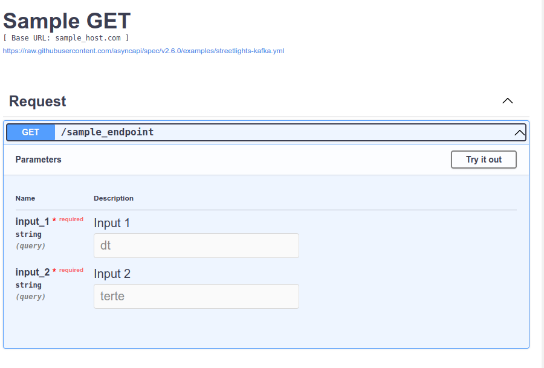
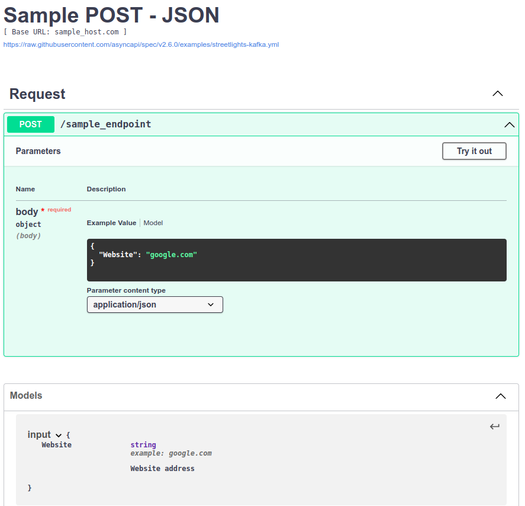
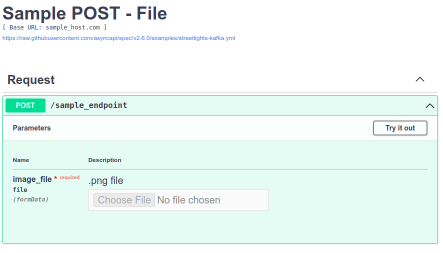

# Swagger-Config-Samples
Sample swagger json config files

### HOW TO RUN:
Add json config files to your local swagger environment.

Try and develop config file via **Swagger Online Editor** (https://editor-next.swagger.io/) 

### DESCRIPTIONS:
**Swagger Get Method:**

https://github.com/EmreDenizz/Swagger-Config-Samples/blob/main/Swagger-GET.json

<kbd></kbd>

**Swagger Post Method - Json:**

https://github.com/EmreDenizz/Swagger-Config-Samples/blob/main/Swagger-POST-JSON.json

<kbd></kbd>

**Swagger Post Method - File:**

https://github.com/EmreDenizz/Swagger-Config-Samples/blob/main/Swagger-POST-File.json

<kbd></kbd>
